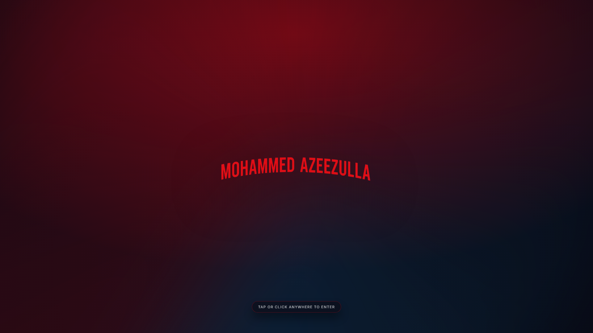
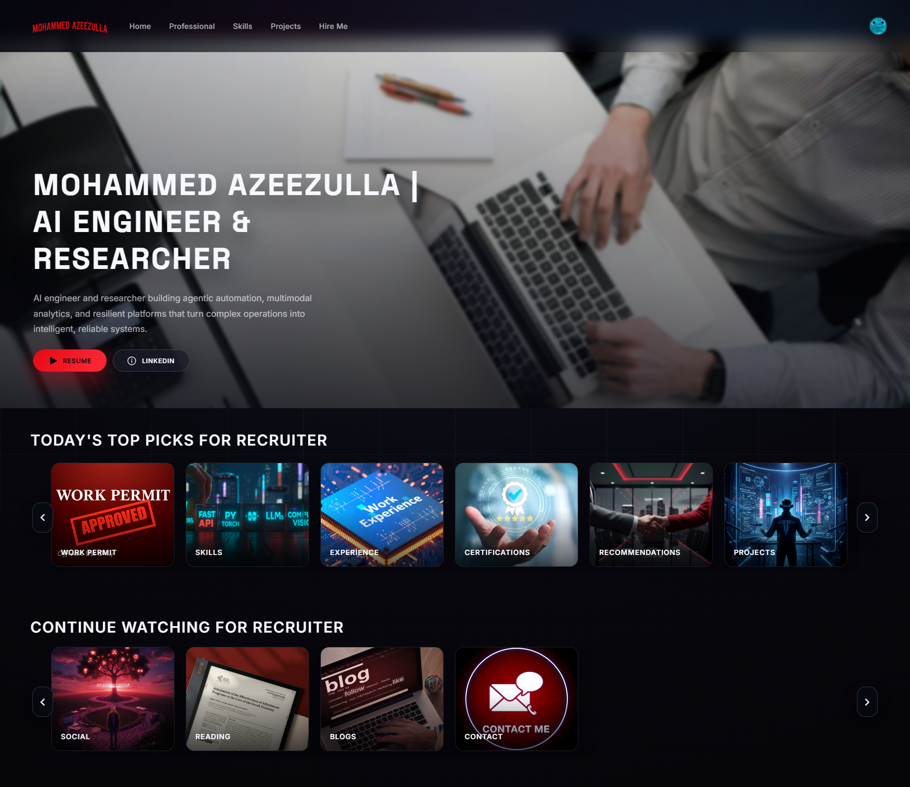
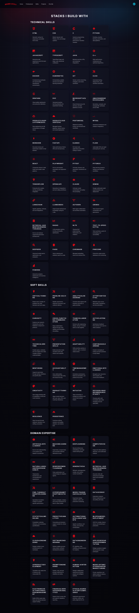
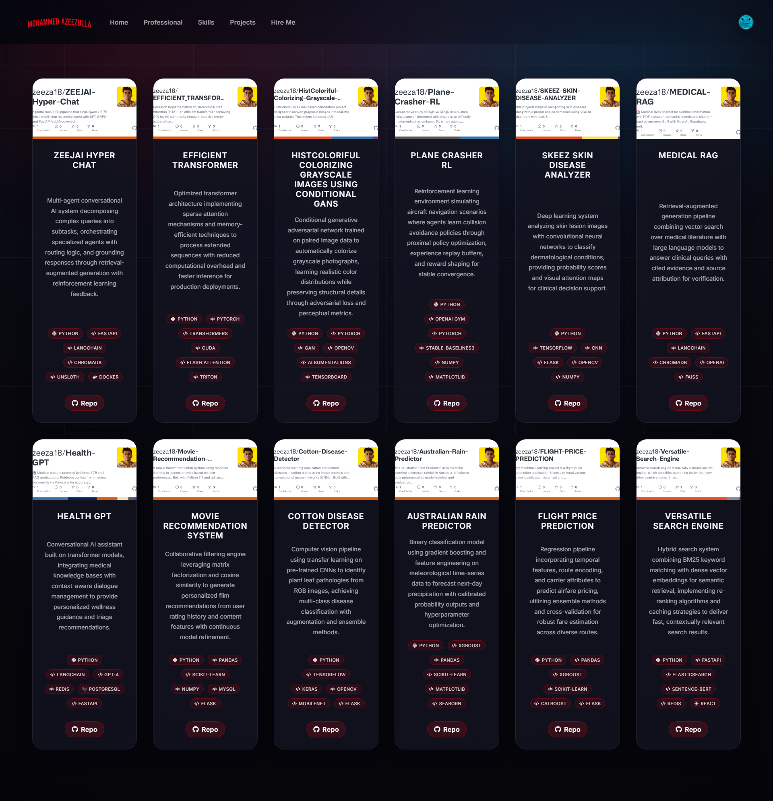
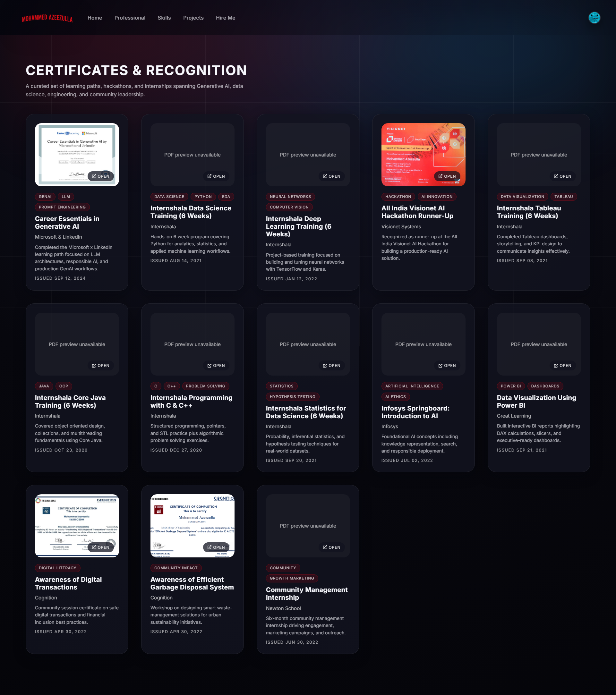

<div align="center">

# Mohammed Azeezulla - AI Engineer Portfolio

### Netflix-Inspired Personal Portfolio

A cutting-edge, immersive portfolio experience built with React, Firebase, and modern web technologies. Features a Netflix-style interface showcasing professional work, projects, skills, and personal moments.

[](https://reactjs.org/)
[](https://www.typescriptlang.org/)
[](https://firebase.google.com/)
[](https://www.datocms.com/)

[Live Demo](https://your-portfolio-url.com) • [LinkedIn](https://www.linkedin.com/in/moazeez/) • [Email](mailto:mmoha134@depaul.edu)

</div>

---

## 📸 Screenshots

### Netflix-Style Intro


### Profile Selection - "Who's Watching?"


### Personalized Dashboard


### Work Experience Timeline


### Skills & Expertise


### Projects Showcase


### Certifications


### Contact Information


---

## ✨ Features

### 🎬 Netflix-Inspired Design
- **Authentic Intro Animation** - Full Netflix intro sequence with sound effects
- **Profile Selection** - "Who's Watching?" interface with 3 distinct personas
- **Row-Based Layout** - Horizontally scrollable content rows with smooth animations
- **Dark Theme** - Netflix-branded colors and typography

### 👤 Multi-Profile Experience
Three personalized profiles for different audiences:

- **Recruiter** - Professional-first view (Work Permit → Skills → Experience)
- **Developer** - Technical focus (Skills → Projects → Experience)
- **Stalker** - Personal content (Social Feed → Reading → Blogs)

### 💼 Professional Content
- **Work Experience** - Interactive vertical timeline with 3 major AI/ML roles
- **Skills Matrix** - 60+ technical, soft, and domain-specific skills with animations
- **Projects** - 12+ GitHub-integrated projects with live demos and tech stacks
- **Certifications** - 15+ professional certifications with preview capability
- **Resume** - Downloadable PDF with work authorization status

### 📱 Social Feed
- **Instagram-Style Interface** - Photo and video posts with likes
- **Real-time Sync** - Firebase Firestore integration for live updates
- **Interactive Features** - Double-tap to like, video mute controls
- **Cross-Device Persistence** - Like counts synced across devices

### 🔗 Integrations
- **GitHub API** - Dynamic project fetching with live metadata
- **DatoCMS** - Headless CMS for content management via GraphQL
- **Firebase** - Real-time database (Firestore) and media storage
- **Cloudinary** - Image optimization and delivery

---

## 🛠️ Tech Stack

### Frontend
- **React 18** - Modern React with hooks and functional components
- **TypeScript** - Static typing for robust code
- **React Router v6** - Client-side routing with lazy loading
- **CSS3** - Custom animations, glassmorphism, gradients

### Backend & Services
- **Firebase Firestore** - NoSQL database for social posts
- **Firebase Storage** - Media file uploads and management
- **DatoCMS** - Headless CMS with GraphQL API
- **GitHub API** - Repository data and project metadata

### Libraries & Tools
- **react-vertical-timeline-component** - Timeline visualization
- **react-icons** - Icon library (FontAwesome, Material Icons)
- **axios** - HTTP client for API requests
- **graphql-request** - GraphQL client for DatoCMS
- **Playwright** - Screenshot automation for documentation

---

## 🚀 Getting Started

### Prerequisites
- Node.js 16+ and npm
- Firebase account (for social features)
- DatoCMS account (optional, has fallback data)

### Installation

1. **Clone the repository**
   ```bash
   git clone https://github.com/zeeza18/PORTFOLIO.git
   cd PORTFOLIO
   ```

2. **Install dependencies**
   ```bash
   npm install
   ```

3. **Set up environment variables**

   Create a `.env` file in the root directory:
   ```env
   # Firebase Configuration
   REACT_APP_FIREBASE_API_KEY=your_firebase_api_key
   REACT_APP_FIREBASE_AUTH_DOMAIN=your_project.firebaseapp.com
   REACT_APP_FIREBASE_PROJECT_ID=your_project_id
   REACT_APP_FIREBASE_STORAGE_BUCKET=your_project.firebasestorage.app
   REACT_APP_FIREBASE_MESSAGING_SENDER_ID=your_sender_id
   REACT_APP_FIREBASE_APP_ID=your_app_id

   # Cloudinary (for media optimization)
   REACT_APP_CLOUDINARY_CLOUD_NAME=your_cloud_name
   REACT_APP_CLOUDINARY_UPLOAD_PRESET=your_upload_preset

   # DatoCMS (optional - fallback data available)
   REACT_APP_DATOCMS_API_TOKEN=your_datocms_token
   ```

4. **Start the development server**
   ```bash
   npm start
   ```

   App will open at [http://localhost:3000](http://localhost:3000)

5. **Build for production**
   ```bash
   npm run build
   ```

---

## 📁 Project Structure

```
src/
├── pages/                      # Main page components
│   ├── Projects.tsx           # GitHub-integrated projects
│   ├── Skills.tsx             # Skills matrix with animations
│   ├── WorkExperience.tsx     # Timeline component
│   ├── Certifications.tsx     # Certificate grid
│   ├── Social.tsx             # Instagram-style feed
│   ├── ContactMe.tsx          # Contact information
│   ├── Blogs.tsx              # Blog posts
│   └── ...
│
├── profilePage/               # Netflix-style dashboard
│   ├── profilePage.tsx        # Main profile view
│   ├── ProfileBanner.tsx      # Hero section
│   ├── TopPicksRow.tsx        # Content rows
│   └── ContinueWatching.tsx   # Recommendations
│
├── browse/                    # Profile selection
│   └── browse.tsx             # "Who's Watching?" page
│
├── components/                # Reusable components
│   ├── NavBar.tsx             # Header with sidebar
│   ├── ProfileCard.tsx        # Profile cards
│   └── ...
│
├── queries/                   # Data fetching layer
│   ├── datoCMSClient.ts       # GraphQL client
│   ├── getProjects.ts         # Projects with fallback
│   ├── getSkills.ts           # Skills data
│   ├── getTimeline.ts         # Work experience
│   └── ...
│
├── utils/                     # Utility functions
│   ├── zeezaPosts.ts          # Firestore CRUD operations
│   ├── zeezaMedia.ts          # Firebase Storage handling
│   └── typography.ts          # Text formatting
│
├── config/                    # Configuration
│   └── firebase.ts            # Firebase initialization
│
├── App.tsx                    # Main routing
├── Layout.tsx                 # Page wrapper
└── NetflixTitle.tsx           # Intro animation
```

---

## 🎨 Key Features Breakdown

### Netflix Intro Sequence
- Authentic Netflix "N" animation with fade-in effect
- Custom sound effect (netflix-sound.mp3)
- Smooth transition to profile selection
- CSS keyframe animations

### Dynamic Content Loading
- **Primary**: DatoCMS via GraphQL queries
- **Secondary**: GitHub API for live project data
- **Tertiary**: Firebase Firestore for social content
- **Fallback**: Hardcoded data ensures content always displays

### Social Feed Implementation
```typescript
// Real-time Firestore integration
- Posts collection with media references
- Atomic like count increments
- localStorage for device-specific likes
- Real-time listeners with onSnapshot
- Firebase Storage for media uploads
```

### Responsive Design
- Mobile-first approach
- Hamburger menu with slide-out sidebar
- Touch-friendly card scrolling
- Breakpoints for tablets and desktops

---

## 🔥 Firebase Setup

### Firestore Collections
- **zeezaPosts** - Social media posts
  - `caption`: string
  - `date`: string
  - `mediaKey`: string (Firebase Storage reference)
  - `likes`: number
  - `createdAt`: timestamp

### Storage Structure
```
/media/
  ├── media-{postId}    # Post media files
  └── ...
```

---

## 📊 Work Experience Highlights

### Current Roles
- **State Street, USA** - AI Engineer (Oct 2025 - Present)
  - GenAI investment intelligence with OpenAI & RAG
  - LangChain vector search for portfolio insights
  - MLOps deployment with Docker & Kubernetes

- **TekAnthem, USA** - AI Engineer Remote (Jun 2025 - Sep 2025)
  - Agentic AI testing with CrewAI & Python
  - Structured extraction pipelines with Azure
  - Multi-agent automation with 60% efficiency gain

### Previous Experience
- **DePaul University** - Graduate Research Assistant & Grader
- **Soulmi Health** - Associate GenAI Developer
- **Streebo Inc, India** - Machine Learning Engineer (2021-2023)

---

## 🎓 Education

- **M.S. in Artificial Intelligence** - DePaul University (2024-2025)
- **B.E. in Computer Science** - MVJ College of Engineering (2019-2023)

---

## 🏆 Skills Overview

### Technical Skills (50+)
Python • PyTorch • TensorFlow • LangChain • OpenAI • CrewAI • React • TypeScript • Docker • Kubernetes • AWS • GCP • Azure • Spark • Kafka • SQL • MongoDB • Redis

### AI/ML Expertise
LLMs • RAG • Transformers • Computer Vision • NLP • Reinforcement Learning • Model Deployment • MLOps • Fine-tuning • Vector Databases

### Domain Knowledge
Financial AI • Healthcare AI • Fraud Detection • Risk Analytics • Agentic Systems • Multimodal AI

---

## 📝 Scripts

```bash
# Development
npm start              # Start dev server on localhost:3000
npm run build          # Production build
npm test               # Run tests

# Screenshots (requires Playwright)
node capture-screenshots.js    # Capture UI screenshots
```

---

## 🌐 Deployment

### Build & Deploy
```bash
# Create optimized production build
npm run build

# Deploy to hosting platform
# (Netlify, Vercel, Firebase Hosting, AWS Amplify, etc.)
```

### Environment Variables for Production
Ensure all Firebase and API credentials are set in your hosting platform's environment configuration.

---

## 🤝 Contributing

This is a personal portfolio project, but suggestions and feedback are welcome!

1. Fork the repository
2. Create a feature branch (`git checkout -b feature/improvement`)
3. Commit changes (`git commit -m 'Add improvement'`)
4. Push to branch (`git push origin feature/improvement`)
5. Open a Pull Request

---

## 📄 License

This project is licensed under the MIT License - see the [LICENSE](LICENSE) file for details.

---

## 📧 Contact

**Mohammed Azeezulla**

- 🌐 Portfolio: [Your Live URL]
- 💼 LinkedIn: [linkedin.com/in/moazeez](https://www.linkedin.com/in/moazeez/)
- 📧 Email: mmoha134@depaul.edu
- 🐙 GitHub: [@zeeza18](https://github.com/zeeza18)

---

## 🙏 Acknowledgments

- Netflix for design inspiration
- React community for excellent documentation
- Firebase for backend infrastructure
- DatoCMS for content management platform
- Open source contributors

---

<div align="center">

**Built with ❤️ by Mohammed Azeezulla**

⭐ Star this repo if you find it helpful!

</div>
